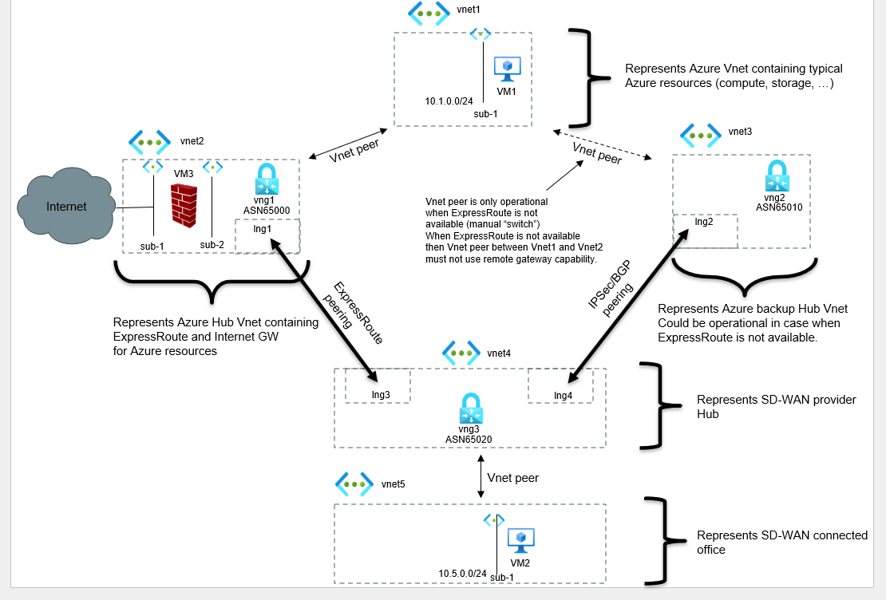
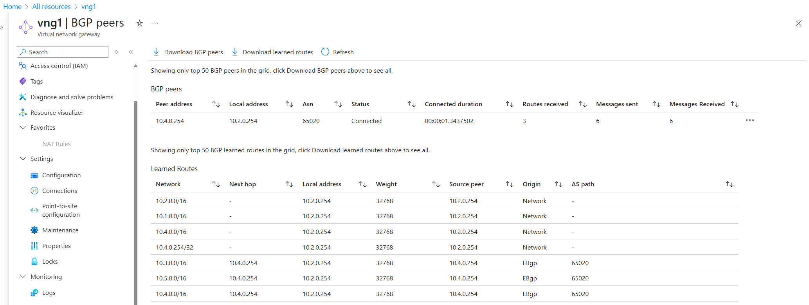
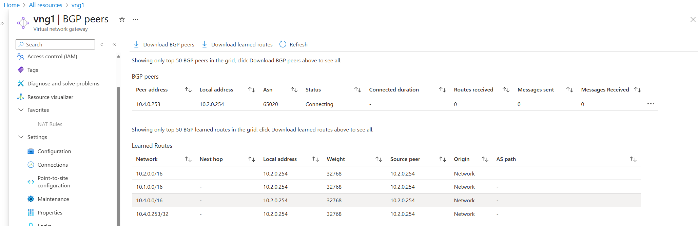
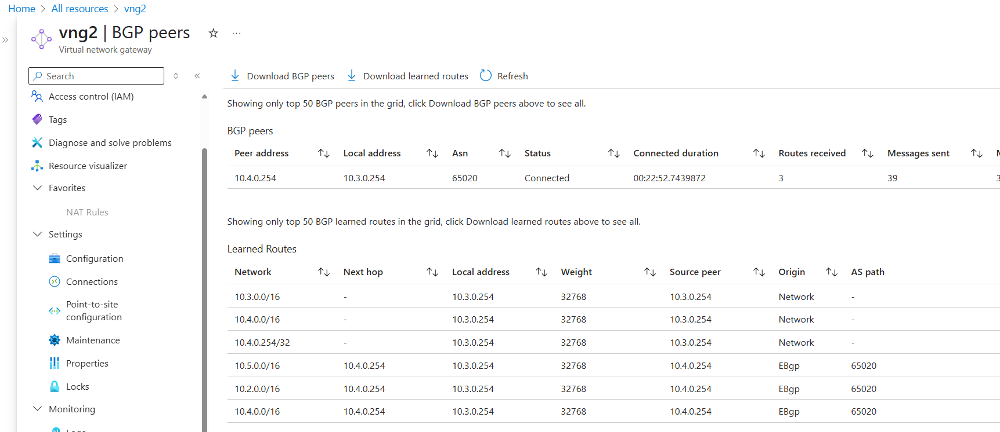
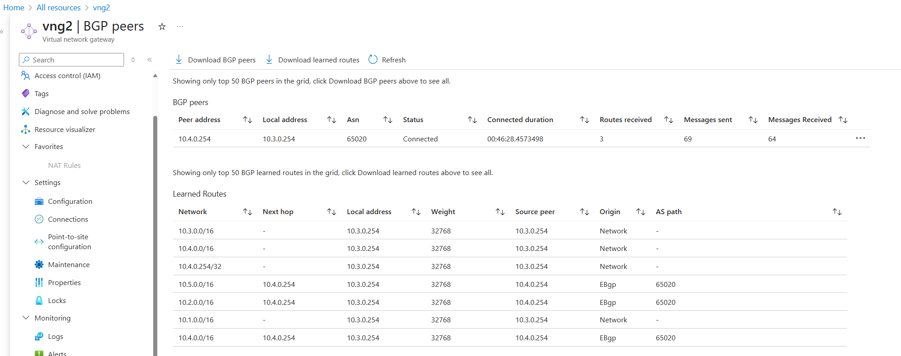

# IPsec based backup connection for primary ExpressRoute.

In this POC lab a design is explored which could be used in a production environment to implement an IPsed based 
backup connection for a primary ExpressRoute object. To limit complexity of the design, the fail-over is performed
manually.

## Introduction 

The lab consists of several Vnets. Each Vnet represents functionality which could be present in a typical production
environment.



- Vnet1: Represents an Azure production Vnet containing typical resources (compute, storage, etc).
- Vnet2: Represents an Azure hub containing an ExpressRoute VNG (Virtual Network Gateway) and an Internet NAT gateway 
for Azure resources from Vnet1.
- Vnet3: Represents an Azure hub containing an IPsec VNG. In this Vnet an IPsec based connection is terminated. 
This connection is used in case the ExpressRoute object is unavailable.
- Vnet4: Represents the SD-WAN provider hub where both ExpressRoute and IPsec VPN are terminated.
- Vnet5: Represents an SD-WAN connected office location.

## Connectivity requirements

1. Azure resources must be able to reach resources on the Internet. In Vnet2, VM3 is used as NAT gateway. VM1 is 
deployed with a public IP address. To avoid connectivity loss while testing when an Azure default (0.0.0.0/0)
User Defined Route is used on the subnet where VM1 is located, a UDR with prefix 8.8.4.4/32 pointing to VM3 is used 
instead for testing purposes. 
2. Azure resources in Vnet1 must be able to reach resources in Vnet5.

## Initial lab environment

The Azure objects are provisioned using Infrastructure As Code (IaC) with Terraform. The code to provide the initial 
setup can be viewed [here](https://github.com/hans-vvv/Azure/blob/main/Demo6/main.tf). 

After the lab has been setup, some other elements needs to be setup.

First the NAT Gateway must be setup on Linux VM3:
```sh
sudo iptables -t nat -A POSTROUTING -o eth0 -j MASQUERADE
sudo iptables -A FORWARD -i eth1 -o eth0 -j ACCEPT
sudo iptables -A FORWARD -i eth0 -o eth1 -m state --state RELATED,ESTABLISHED -j ACCEPT

sudo ip route add 10.0.0.0/8 via 10.2.2.1 dev eth1

sudo sysctl -w net.ipv4.ip_forward=1

sudo apt install conntrack
```

Then, using the Azure GUI, a User Defined Route (UDR) must be attached to the subnet vnet1-sub1. This UDR must contain
a route to 8.8.4.4/32 to the inside interface of VM3 (10.2.2.4). 

Then ping 8.8.4.4 on VM1 to verify the first connectivity requirement:
```
hans@vm1:~$ ping 8.8.4.4
PING 8.8.4.4 (8.8.4.4) 56(84) bytes of data.
64 bytes from 8.8.4.4: icmp_seq=1 ttl=115 time=3.24 ms
64 bytes from 8.8.4.4: icmp_seq=2 ttl=115 time=2.19 ms
64 bytes from 8.8.4.4: icmp_seq=3 ttl=115 time=3.14 ms
^C
```

But also check on VM3 if the traffic is routed via the NAT gateway on VM3. This is done by querying the NAT table 
on VM3.
```
hans@vm3:~$ sudo conntrack -L | grep "8.8.4.4"
icmp     1 29 src=10.1.0.4 dst=8.8.4.4 type=8 code=0 id=2445 src=8.8.4.4 dst=10.2.1.4 type=0 code=0 id=2445 mark=0 use=1
```

To verify the second connectivity requirement, a ping from VM1 to VM2 is performed:
```
hans@vm1:~$ ping 10.5.0.4
PING 10.5.0.4 (10.5.0.4) 56(84) bytes of data.
64 bytes from 10.5.0.4: icmp_seq=1 ttl=64 time=6.33 ms
64 bytes from 10.5.0.4: icmp_seq=2 ttl=64 time=4.86 ms
^C
```

## Querying BGP information

The BGP session between VNG1 and VNG2 can be queried using the GUI:

A few observations can be made from the screenshot:
1. The BGP session between VNG1 and VNG2 is operational (status=Connected)
2. All supernets (10.1.0.0/16 till 10.5.0.0/16) from all Vnets are present in the BGP tables.

## Simulation of an ExpressRoute failure.
An ExpressRoute object is represented in Azure as a single object, although it consists of tho underlying leased lines
to connect the Azure infrastructure to the customer equipment.

To mimic an ExpressRoute failure, the following Terraform code is used to disable the BGP peer between VNG1 and VNG2:
```sh
resource "azurerm_local_network_gateway" "lng1" {
  name                = "lng1"
  location            = azurerm_resource_group.rg-we.location
  resource_group_name = azurerm_resource_group.rg-we.name

  gateway_address     = null_resource.wait_for_vng3_ip.triggers.ip
  address_space       = ["10.4.0.0/16"]

  bgp_settings {
    asn                 = 65020
    bgp_peering_address = "10.4.0.253"
  }
  depends_on = [azurerm_virtual_network_gateway.vng3]
}
```
The BGP peering address is an unused IP address and will result in a non-operational BGP peering status:


Given the BGP status between VNG1 and VNG2, connectivity between VM1 and VM2 should be broken, but the connectivity
between VM1 and 8.8.4.4 should be remained intact:
```
hans@vm1:~$ ping 10.5.0.4
PING 10.5.0.4 (10.5.0.4) 56(84) bytes of data.
^C
--- 10.5.0.4 ping statistics ---
5 packets transmitted, 0 received, 100% packet loss, time 4083ms

hans@vm1:~$
hans@vm1:~$ ping 8.8.4.4
PING 8.8.4.4 (8.8.4.4) 56(84) bytes of data.
64 bytes from 8.8.4.4: icmp_seq=1 ttl=115 time=2.80 ms
64 bytes from 8.8.4.4: icmp_seq=2 ttl=115 time=2.38 ms
64 bytes from 8.8.4.4: icmp_seq=3 ttl=115 time=2.41 ms
^C
--- 8.8.4.4 ping statistics ---
3 packets transmitted, 3 received, 0% packet loss, time 2003ms
rtt min/avg/max/mdev = 2.380/2.533/2.805/0.196 ms
```


## Manually connectivity restoration procedure.

The IPsec/BGP tunnel between VNG2 and VNG3 has been set up upfront:

From the BGP tables it can be concluded that there is no connectivity between VM1 and VM2. The reason is that prefix
10.1.0.0/16 is missing in the BGP table of VNG2. This is caused by the fact that there is no Vnet peering present
between Vnet1 and Vnet3 yet. Before enabling this peering, the current peering between Vnet1 and Vnet2 must be changed.
This change must ensure that Vnet2 cannot be longer used as remote gateway for Vnet1. The peering cannot be removed, 
because this will break the requirement of providing Internet connectivity for Azure resources, as the UDR next-hop 
of the inside interface of VM3 must remain present in the BGP table of Vnet1.
```sh
resource "azurerm_virtual_network_peering" "vnet1-to-vnet2" {
  name                      = "vnet1-to-vnet2"
  resource_group_name       = azurerm_resource_group.rg-we.name
  virtual_network_name      = azurerm_virtual_network.vnet1.name
  remote_virtual_network_id = azurerm_virtual_network.vnet2.id

  allow_virtual_network_access = true
  allow_forwarded_traffic      = false
  allow_gateway_transit        = false
  use_remote_gateways          = false
}

resource "azurerm_virtual_network_peering" "vnet2-to-vnet1" {
  name                      = "vnet2-to-vnet1"
  resource_group_name       = azurerm_resource_group.rg-we.name
  virtual_network_name      = azurerm_virtual_network.vnet2.name
  remote_virtual_network_id = azurerm_virtual_network.vnet1.id

  allow_virtual_network_access = true
  allow_forwarded_traffic      = false
  allow_gateway_transit        = false
  use_remote_gateways          = false

  depends_on = [azurerm_virtual_network_peering.vnet1-to-vnet2]
}
```

The connectivity between VM1 and VM2 is still broken, but VM1 is still able to reach 8.8.4.4 via VM3:
```
hans@vm1:~$ ping 10.5.0.4
PING 10.5.0.4 (10.5.0.4) 56(84) bytes of data.

^C
--- 10.5.0.4 ping statistics ---
3 packets transmitted, 0 received, 100% packet loss, time 2042ms

hans@vm1:~$ ping 8.8.4.4
PING 8.8.4.4 (8.8.4.4) 56(84) bytes of data.
64 bytes from 8.8.4.4: icmp_seq=1 ttl=115 time=2.31 ms
64 bytes from 8.8.4.4: icmp_seq=2 ttl=115 time=2.47 ms
64 bytes from 8.8.4.4: icmp_seq=3 ttl=115 time=2.85 ms
^C
--- 8.8.4.4 ping statistics ---
3 packets transmitted, 3 received, 0% packet loss, time 2003ms
rtt min/avg/max/mdev = 2.319/2.548/2.851/0.227 ms
```

To restore the connectivity between VM1 and VM2, the following Vnet peering must be established between Vnet1 and Vnet3.
```sh
resource "azurerm_virtual_network_peering" "vnet1-to-vnet3" {
  name                      = "vnet1-to-vnet3"
  resource_group_name       = azurerm_resource_group.rg-we.name
  virtual_network_name      = azurerm_virtual_network.vnet1.name
  remote_virtual_network_id = azurerm_virtual_network.vnet3.id

  allow_virtual_network_access = true
  allow_forwarded_traffic      = true
  allow_gateway_transit        = false
  use_remote_gateways          = true
}

resource "azurerm_virtual_network_peering" "vnet3-to-vnet1" {
  name                      = "vnet3-to-vnet1"
  resource_group_name       = azurerm_resource_group.rg-we.name
  virtual_network_name      = azurerm_virtual_network.vnet3.name
  remote_virtual_network_id = azurerm_virtual_network.vnet1.id

  allow_virtual_network_access = true
  allow_forwarded_traffic      = true
  allow_gateway_transit        = true
  use_remote_gateways          = false

  depends_on = [azurerm_virtual_network_peering.vnet1-to-vnet3]
}
```

After applying the change, on VNG2 the prefix 10.1.0.0/16 is present in the BGP table now:


And connectivity between VM1 and VM2 is restored:
```
hans@vm1:~$ ping 10.5.0.4
PING 10.5.0.4 (10.5.0.4) 56(84) bytes of data.
64 bytes from 10.5.0.4: icmp_seq=1 ttl=64 time=9.66 ms
64 bytes from 10.5.0.4: icmp_seq=2 ttl=64 time=10.4 ms
^C
--- 10.5.0.4 ping statistics ---
2 packets transmitted, 2 received, 0% packet loss, time 1001ms
rtt min/avg/max/mdev = 9.668/10.047/10.427/0.392 ms
```